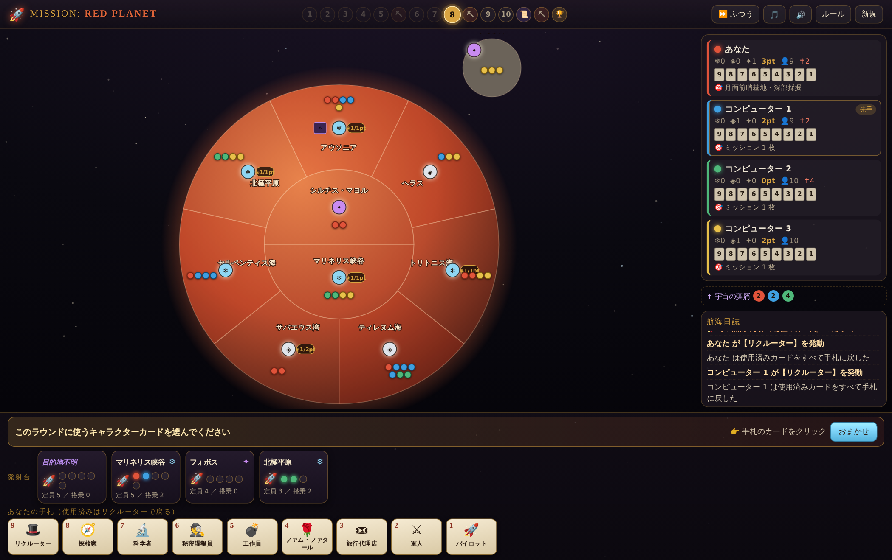

# ミッション・レッドプラネット — ブラウザ版

ボードゲーム **[Mission: Red Planet (Second/Third Edition)](https://boardgamegeek.com/boardgame/176920/mission-red-planet-secondthird-edition)**
（Bruno Faidutti / Bruno Cathala 作）のルールをもとにした、ブラウザだけで遊べる非公式のファンメイド実装です。

西暦 1888 年、蒸気機関の時代。あなたは採掘企業の総帥として 9 人の腹心を送り込み、
宇宙船を火星へ飛ばし、各エリアで多数派を握って氷・シルバナイト・セレリウムを手に入れます。



## 遊びかた

`index.html` をブラウザで開くだけです。ビルドもインストールも、サーバーも不要です。

```
git clone <このリポジトリ>
cd redplanet
# ダブルクリックで index.html を開く、または
xdg-open index.html      # Linux
open index.html          # macOS
```

ローカルサーバー経由で開きたい場合は、任意の静的サーバーで配信できます。

```
python3 -m http.server 8080     # → http://localhost:8080/
```

対応ブラウザ：Chrome / Edge / Firefox / Safari の最近のバージョン。スマートフォンでも遊べます。

## 特徴

- **2〜6 人プレイ**（あなた 1 人 ＋ コンピューター 1〜5 人）
- **ルールベースの簡易 AI**。エリアの期待価値と多数派の変動を評価して、
  キャラクター・配置先・破壊対象などを選びます。強敵ではありませんが、
  価値の高いエリアを狙い、他プレイヤーを妨害してきます。
- **手続き的に合成した効果音**（Web Audio API）。音声ファイルは 1 つも含まれていないため、
  読み込みは一瞬で、通信も発生しません。効果音・環境音は個別にオン／オフできます。
- **軽量なアニメーション**。星空は Canvas 1 枚（タブが非表示になると自動停止）、
  それ以外はすべて CSS トランジション／アニメーションと少数の DOM パーティクルです。
  `prefers-reduced-motion` を尊重します。
- 演出の速さを「じっくり／ふつう／きびきび」から選べます。
- 迷ったときは **「おまかせ」ボタン**で AI と同じ判断を代行できます。

## ゲームの流れ

10 ラウンド。1 ラウンドは次の 6 ステップです。

1. 全員が手札から **キャラクターカードを 1 枚同時に選ぶ**
2. **9 → 1 のカウントダウン**順に公開し、効果を解決する
3. 定員に達した（または強制発射された）宇宙船が**着陸**し、乗員を目的地エリアに降ろす
4. 空いたドックに新しい宇宙船を補充する
5. 最後に効果を解決したプレイヤーが次の先手になる
6. ラウンドトラッカーを進める

ラウンド 5・8・10 のあとに**生産フェイズ**があり、資源が公開済みの各エリアが
1 個 → 2 個 → 3 個の得点トークンを産出します。そのエリアで宇宙飛行士が最も多いプレイヤーが
エリア上の得点トークンをすべて受け取ります（同数なら山分けし、余りはエリアに残ります）。
ラウンド 10 のあとに発見カードが一斉公開され、第 3 生産フェイズ、最終得点計算と続きます。

一度使ったキャラクターは、**リクルーター**を使うまで手札に戻りません。

### キャラクター

| # | 名前 | 効果 |
|---|---|---|
| 9 | リクルーター | 宇宙飛行士を 1 体乗せ、使用済みカードをすべて手札に戻す |
| 8 | 探検家 | 1 体乗せ、火星上の自分の宇宙飛行士を合計 3 回まで隣接エリアへ移動 |
| 7 | 科学者 | 2 体乗せ、イベントカードを 1 枚引く／裏向きの発見カードを 1 枚確認 |
| 6 | 秘密諜報員 | 異なる船に 1 体ずつ計 2 体乗せ、ドック中の船 1 隻を強制発射 |
| 5 | 工作員 | 1 体乗せ、ドック中の船 1 隻を破壊（乗員は全滅） |
| 4 | ファム・ファタール | 1 体乗せ、自分がいる船／エリアの他人の宇宙飛行士 1 体と入れ替え |
| 3 | 旅行代理店 | 空席 3 以上の船 1 隻に 3 体まとめて乗せる（不可能なら不発） |
| 2 | 軍人 | 同じ船に 2 体乗せ、中央 2 エリア以外の宇宙飛行士 1 体を排除 |
| 1 | パイロット | 2 体乗せ、宇宙船 1 隻の目的地を変更 |

### 地図

火星は中央の 2 エリア（シルチス・マヨル／マリネリス峡谷）と、それを囲む
7 つの外周エリア（アウソニア／ヘラス／トリトニス湾／ティレヌム海／サバエウス湾／
セルペンティス海／北極平原）からなります。衛星フォボスはどのエリアにも隣接していません。

## 構成

ビルド手順のない素の HTML / CSS / JavaScript です。外部ライブラリは使っていません。

```
index.html          画面の骨組み
css/style.css       スタイルとアニメーション
js/util.js          乱数・SVG・汎用ヘルパー
js/data.js          エリア／キャラクター／宇宙船／イベントカードの定義
js/audio.js         Web Audio による効果音の合成
js/fx.js            星空・パーティクル・バナー
js/engine.js        ルールエンジン（UI から独立、Node でも動く）
js/ai.js            ルールベース AI
js/ui.js            描画と操作、人間プレイヤーのエージェント
js/main.js          起動処理・スタート画面・ルール表示
```

`js/engine.js` は DOM に依存しないので、Node 上で AI 同士の対局を回して
検証できます（宇宙飛行士の総数、目的地トークンの上限、完走などを確認）。

## 実装上の注記

公式ルールブックに沿って実装していますが、次の点は本実装の解釈・補完です。
遊びやすさのために調整した箇所も含みます。

- **エリアの隣接関係と盤面のかたち**は、実物のボードの地図を参考にしつつ、
  「中央 2 エリア＋外周 7 エリア」という構造を保った同心円状のレイアウトとして
  作り直しています。実物と完全に同じ隣接関係ではありません。
- **赤いエリア**（ミッション「東方進出」の対象）は
  アウソニア／ヘラス／ティレヌム海／セルペンティス海の 4 か所としています。
- **イベントカード 30 枚**（発見 13・ミッション 13・アクション 4）は、
  公開情報として確認できたカード（エーテル磁石、シナジー、地衣類、原住民の抵抗、
  採掘事故、平坦な地形／起伏の激しい地形、謀略、氷塊、東方進出、戦略拠点 など）を
  含みつつ、残りは同じ作りに沿って本実装で用意したものです。
- **アクションカード**は、プレイヤーがタイミングを選ぶ代わりに、
  カードに書かれたタイミング（第 3 生産フェイズの直前／終了時）で自動的に発動します。
  対象が必要な場合は最も有利になる対象が自動で選ばれます。
- **発見カード「大砂嵐」「起伏の激しい地形」**など、原典の文面を確認できなかったものは
  本実装での定義です。カードの文面はゲーム内のログとツールチップで確認できます。
- **2 人プレイ**は公式の「中立色」バリアントではなく、通常ルールをそのまま適用します。
- ファム・ファタールの入れ替え対象は、他プレイヤーの宇宙飛行士に限定しています。

## ライセンスと権利について

これは学習・趣味目的の非公式なファンメイド実装です。
*Mission: Red Planet* のゲームデザインおよび商標は、デザイナーおよび権利者に帰属します。
本リポジトリには公式のアートワーク・カードテキスト・ロゴなどの素材は含まれておらず、
画面表示はすべてコードで生成しています。
